# 🚀 快速构建指南

## 立即开始使用

### 方法1: 使用批处理脚本 (推荐 - 无需安装)

```bash
# 构建压缩文件
.\build.bat

# 清理构建文件
.\build.bat clean

# 查看帮助
.\build.bat help
```

### 方法2: 使用 Node.js (完整功能)

如果您有 Node.js 环境：

```bash
# 安装依赖
npm install

# 构建
npm run build

# 开发模式 (文件监听)
npm run dev

# 测试
npm test
```

## 🎯 核心优势

### 💰 **节省Token成本**
- AI助手只需处理源代码 `data/cheat.js`
- 压缩工作完全自动化
- 避免手动压缩的错误和重复工作

### ⚡ **提高开发效率**
- 编辑源码 → 自动生成压缩版
- 一键构建，无需复杂操作
- 专注功能开发，不用担心压缩问题

### 🛡️ **质量保证**
- 自动语法检查
- 保留关键函数名和变量
- 智能压缩，不破坏功能

## 📝 开发工作流

```mermaid
graph LR
    A[编辑 cheat.js] --> B[运行 build.bat]
    B --> C[生成 cheat.min.js]
    C --> D[测试功能]
    D --> E[提交代码]
    
    F[AI助手] --> A
    F -.->|不再需要处理| C
```



## 🔧 文件说明

| 文件 | 作用 | 是否编辑 |
|------|------|----------|
| `data/cheat.js` | 源代码 | ✅ 您编辑 |
| `data/cheat.min.js` | 压缩版本 | ❌ 自动生成 |
| `build.bat` | 构建脚本 | ❌ 工具文件 |

## 🎉 立即体验

1. **编辑源码**: 修改 `data/cheat.js`
2. **运行构建**: `.\build.bat`
3. **查看结果**: 检查 `data/cheat.min.js`

就是这么简单！

---

💡 **提示**: 使用此构建系统后，AI助手的工作效率将大大提升，因为不再需要处理繁琐的代码压缩工作！

